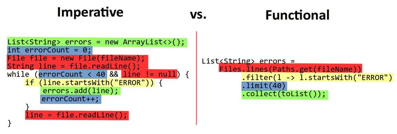
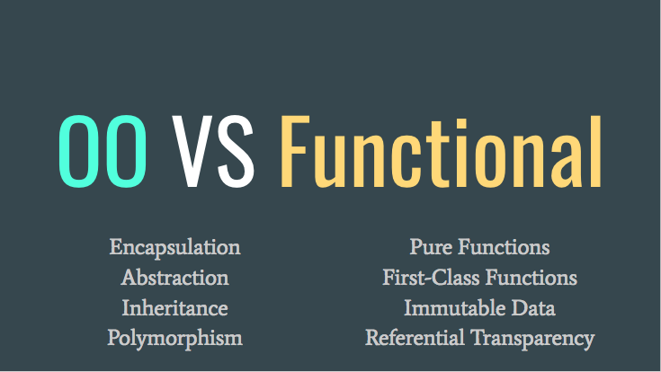
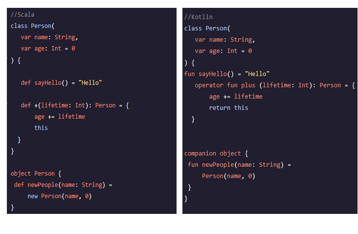

# Functional Programming 

By Jesús Martínez and Tomás Cayuelas

Powered By [Markdown to Slideshow](https://mark.show/)

---

## What it is?

Functional programming is a paradigm where programs are constructed by applying and composing functions. This allows programs to be written in a declarative and composable style, where small functions are combined in a modular manner.

---

## Characteristics

- Uses pure functions, which allow referential transparecy
- Avoids shared state
- Works with immutable data
- Minimizes/isolates side-effects
- Support higher-order functions
- Support of abstractions, encapsulations, inheritance and polymorphism
- Don't support flow-controls (if-else, switch, loops), but rather uses 

---

## How it  works?

[Plywood line](https://www.youtube.com/watch?v=3Wh9NYvfStk)

---

## Languages

### Pure
* Agda, Elm, Haskell, Hope, Idris, PureScript, SequenceL, etc...

### Impure
* Python, Java (since 1.8), **Kotlin**, Ruby, **Scala**, Perl, F#, Rust, OCaml, PHP, Dart, C#, Lisp, etc...

---

## Benefits
  - Pure functions are easier to reason about. 
  - Better suited for concurrency and parallel programming.
  - Usually strong-typed, helps reducing bugs and improves testing.
  - Programs are written at a higher level, and are therefore easier to comprehend.
  - Programs are stateless
---

## Drawbacks
  - Using only immutable values and recursion can potentially lead to performance problems, including RAM use and speed.
  - Requires different thinking from imperative programming.
  - Writing pure functions is easy, but combining them into a complete application is where things get hard.
  - The advanced math terminology (monad, monoid, functor, etc.) makes FP intimidating.

---
    
## Imperative vs Functional

---

## OOP patterns vs FP patterns :troll_face:

---

## OOP vs Functional

---

## Scala vs Kotlin

---

## 

# References

- [Wikipedia definition](https://en.wikipedia.org/wiki/Functional_programming)
- [https://alvinalexander.com/scala/fp-book/disadvantages-of-functional-programming/](https://alvinalexander.com/scala/fp-book/disadvantages-of-functional-programming/)
- [https://alvinalexander.com/scala/fp-book/benefits-of-functional-programming/](https://alvinalexander.com/scala/fp-book/benefits-of-functional-programming/)
- [https://qvault.io/clean-code/benefits-of-functional-programming/](https://qvault.io/clean-code/benefits-of-functional-programming/)
- [https://www.tutorialspoint.com/functional_programming/functional_programming_introduction.htm](https://www.tutorialspoint.com/functional_programming/functional_programming_introduction.htm)
- [https://www.keycdn.com/blog/functional-programming](https://www.keycdn.com/blog/functional-programming)
- [https://blog.cleancoder.com/uncle-bob/2014/11/24/FPvsOO.html](https://blog.cleancoder.com/uncle-bob/2014/11/24/FPvsOO.html)

